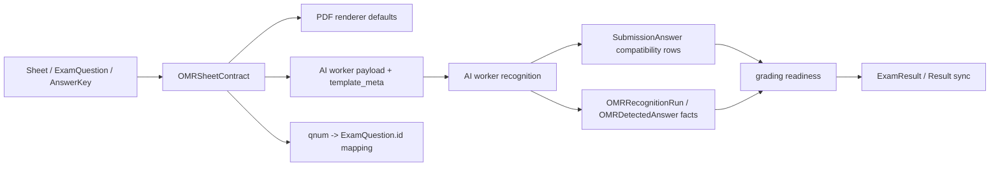

# OMR 자동채점 시스템 — SSOT

## 개요

학원 시험의 객관식과 0~999 숫자 단답을 OMR 답안지로 수집하고 AI 워커로 자동 채점하는 시스템.

## SSOT 구조

| 구성요소 | SSOT 파일 | 역할 |
|----------|-----------|------|
| **시험지 계약** | `backend/academy/domain/omr/contract.py` | OMR이 읽을 객관식/단답형 경계, 문제 ID 매핑, 계약 fingerprint |
| **계약 빌더** | `backend/apps/support/omr/contract_builder.py` | `Sheet`/`ExamQuestion`/`AnswerKey`에서 `OMRSheetContract` 생성 |
| **답안지 렌더링** | `backend/apps/domains/assets/omr/renderer/pdf_renderer.py` | 인쇄/PDF용 OMR 답안지. 표시용 영역은 채점 계약과 분리 |
| **좌표 메타** | `backend/apps/domains/assets/omr/services/meta_generator.py` | mm 단위 버블/ROI 좌표 (AI 워커용) |
| **답안 검출** | `backend/academy/adapters/ai/omr/engine.py` | 스캔 이미지에서 마킹 감지 |
| **식별자 검출** | `backend/academy/adapters/ai/omr/identifier.py` | 전화번호 뒤 8자리 감지 |
| **결과 반영** | `backend/apps/domains/submissions/services/ai_omr_result_mapper.py` | 워커 결과를 답안/fact/학생매칭 상태로 반영 |
| **인식 fact** | `backend/apps/domains/submissions/models/omr_fact.py` | 인식 run, 문항별 감지값, 학생 매칭 fact 저장 |

## OMR v2 계약 구조

OMR은 더 이상 `total_questions` 하나를 여러 서비스가 각자 해석하지 않는다. 모든 런타임 경로는 먼저 `OMRSheetContract`를 만든 뒤 그 계약을 기준으로 렌더링, 워커 payload, 답안 저장, 인식 fact, 채점 준비도를 판단한다.



### 계약 원칙
- `total_questions`는 시험 전체 문항 수다.
- `choice_count`는 객관식 문항 수다.
- `essay_count`는 단답형 문항 수다. 필드명은 기존 API/워커 계약 호환을 위해 유지한다.
- 수학 시험의 단답형 정답키가 ASCII 숫자 정수 `0~999`이면 백·십·일 자리 버블을 자동 인식·채점한다. `007`과 `7`은 같은 답으로 정규화한다.
- 숫자 정답키가 없거나 범위를 벗어난 일반 서술 답안은 자동 인식 계약에서 제외하고 기존 수동 채점을 유지한다.
- `essay_count=0`인 객관식 전용 시험은 객관식 40문항 이하에서 사용자가 기본 5줄짜리 `단답형 공간`을 표시하거나 숨길 수 있다. 41문항부터는 3열 객관식 레이아웃을 우선해 자동으로 숨긴다.
- 표시 선택은 요청의 `include_optional_essay_area`에만 존재하는 렌더링 옵션이다. `OMRSheetContract`, 워커 payload, 정답키, 좌표 메타, 답안 저장, 채점에는 포함하지 않는다.
- 답안 저장은 계약에 등록된 객관식 번호와 숫자 단답 번호만 허용한다.
- 워커가 일반 서술형 번호를 보내면 그 값은 fact로는 남기되 `SubmissionAnswer`로 저장하지 않는다.
- 워커 원본 답안 수와 계약상 `auto_detect_count`가 다르면 `ANSWER_COUNT_MISMATCH`로 수동 검토가 필요하다.
- `OMRRecognitionRun.contract_snapshot`은 인식 당시 계약의 fingerprint, 객관식/단답형 경계, `auto_detect_count`를 저장한다.

### 레거시 호환
- `Sheet.choice_count`/`essay_count`가 있으면 그 값을 우선한다.
- 구형 sheet처럼 경계가 없으면 `AnswerKey`를 기준으로 객관식 답(`1~5`, `2,3`, `2|4`, `①` 등)과 단답형 텍스트를 구분해 경계를 추론한다.
- 추론도 불가능하면 기존 호환을 위해 `total_questions` 전체를 객관식으로 본다.

### 검증 매트릭스
- 객관식 전용: `12/0`, `20/0`, `30/0`은 표시용 `단답형 공간`을 선택할 수 있고, `60/0`은 자동으로 숨긴다. 어느 경우든 계약상 단답형은 0문항이며 채점에는 포함되지 않는다.
- 혼합형: `20/5`에서 숫자 정답키가 등록된 q21~q25는 자리별 버블 인식·자동 채점, 일반 서술 정답은 수동 유지
- 단답형 전용: `0/20`까지 한 페이지에 생성할 수 있으며 숫자 정답키가 등록된 문항은 자동 채점
- 레거시 추론: `①`, `2,3`, `2|4`, 단답형 텍스트 혼합 answer key
- 워커 이상 응답: 원본 답안 수와 계약 객관식 수 불일치 시 `ANSWER_COUNT_MISMATCH`
- 워커 이상 응답: 원본 답안 수가 맞아도 중복 문항 때문에 고유 객관식 번호 수가 부족하면 `ANSWER_COUNT_MISMATCH`
- 운영 완료 판정: 배포 후 deploy verification, 운영 sheet 분포 read-only audit, Tenant 2 실제 OMR canary 재인식/재채점 또는 rollback 검증

## 레이아웃 (A4 Landscape, 297×210mm)

```
┌──────────────────────────────────────────────────────────┐
│ L-mark                                           L-mark │
│                                                          │
│  ┌─Left(62mm)──┐  3mm  ┌─MC(44mm)─┐ 2.5 ┌─MC(44mm)─┐  │
│  │ [Logo]      │       │ 1  12345 │     │16  12345 │  │
│  │ 시험명      │       │ 2  12345 │     │17  12345 │  │
│  │             │       │ ...      │     │ ...      │  │
│  │─────────────│       │15  12345 │     │30  12345 │  │
│  │ 성명        │       └──────────┘     └──────────┘  │
│  │─────────────│                                       │
│  │ 전화8자리   │       ┌─단답형 0~999────────────────┐│
│  │ [XXXX-XXXX] │       │ 1  [백 0~9][십 0~9][일 0~9]││
│  │ [0-9 버블]  │       │ 2  [백 0~9][십 0~9][일 0~9]││
│  │─────────────│       │ ...                          ││
│  │ 작성안내    │       └──────────────────────────────┘│
│  └─────────────┘                                       │
│                                                          │
│ L-mark                                           L-mark │
└──────────────────────────────────────────────────────────┘
```

## 좌표 체계 (meta_generator.py)

### 페이지 상수
- 페이지: 297mm × 210mm
- 마진: 좌10, 상9, 우10, 하6 (mm)
- 좌측 패널: 62mm 폭
- 객관식 컬럼: 44mm 폭 (고정), 최대 3컬럼
- 컬럼 간격: 2.5mm

### 버블
- 쌀톨형 세로 타원: 3.6mm × 5.2mm
- 선택지: "1"~"5" (숫자)
- 숫자 단답: 백·십·일 각 자리의 "0"~"9". 사용하지 않는 앞자리는 비우고 일의 자리는 반드시 마킹
- 식별번호: "0"~"9" (세로 10행 × 가로 8열)

### 식별자 (전화번호 뒤 8자리)
- 4자리 - 4자리 구조
- 기입칸 8개 + 아래 0~9 버블 그리드
- 학생 본인 휴대폰 번호 우선, 없으면 부모님 번호

## 채점 대상 SSOT

- **OMR 채점 대상의 기준은 시험이 연결된 차시의 `SessionEnrollment` roster다.**
- `ExamEnrollment`는 시험별 명시 대상자이자 기존 API 호환 레이어다. OMR 업로드/학생 매칭/성적 수동입력 시점에 차시 roster 학생이면 자동으로 materialize할 수 있으며, OMR 채점의 선행 조건이 아니다.
- 후보 학생은 항상 같은 tenant, 활성 `Enrollment`, 삭제되지 않은 학생으로 제한한다. 다른 tenant나 시험이 연결되지 않은 차시의 학생으로 fallback하지 않는다.
- 성적탭 row 모수는 차시 출석/수강 roster다. 시험 점수 셀은 `ExamEnrollment`가 없어도 차시에 붙은 시험의 OMR/수동입력 대상 학생에게 보여야 한다.
- 오인식/미식별 스캔은 `Submission`의 수동 검토 상태와 답안 보정 API를 통해 보정한다. 원본 운영 데이터를 임의로 수정하지 않고, 검토자가 선택적으로 답안/점수를 확정한다.

## 운영 UX SSOT

- 선생/원장은 **강의 > 차시 > 성적** 화면에서 OMR을 등록한다. 별도 도구 화면은 OMR 양식 생성/출력용 보조 도구이며, 차시 채점의 주 동선이 아니다.
- 성적 화면의 주 CTA는 `OMR 스캔 등록`이다. 시험이 1개면 바로 업로드 모달을 열고, 여러 개면 시험 선택만 거쳐 같은 업로드 모달로 진입한다.
- 시험 설정/제출관리 화면은 OMR 스캔을 직접 등록하지 않는다. 등록이 필요하면 성적 탭으로 이동시키고, 해당 화면은 출력/대상자/제출 확인/재채점 보조 역할만 맡는다.
- `수강생 일괄배정`은 자동 materialize 실패나 운영 보정용 보조 기능이다. 초보 사용자 기본 흐름에서는 숨기고 더보기 메뉴에 둔다.
- 업로드 화면은 "파일 선택 -> 등록 시작 -> 성적표/드로어에서 결과 확인"으로 읽혀야 한다. OMR 스캔 등록을 위해 사용자가 여러 화면을 이해해야 하는 설계를 만들지 않는다.
- 학생 상세 드로어는 OMR 스캔 썸네일/정렬된 미리보기와 수동 답안 보정 진입점을 제공해야 한다. 자동 인식이 틀릴 수 있음을 전제로, 보정은 선택적으로 가능해야 한다.

### 직접 채점 결과 엑셀 가져오기

OMR 사용이 어려운 혼합형 시험은 같은 성적 저장 경로에 엑셀 정오표를 넣을 수 있다.

- 진입점: **시험 → 채점·결과 → 엑셀로 채점 결과 넣기**
- 전용 양식은 시험 응시 대상 학생과 실제 `ExamQuestion.number` 열을 포함한다.
- 정답 표시는 빈칸 또는 `O`, 오답 표시는 `X`다. 업로드 전에 학생 매칭·문항 수·표시값·예상 점수를 미리 검증하고, 사용자가 **결과 반영**을 눌러야 저장한다.
- 기존 채점표도 이름 또는 연락처와 숫자 문항 헤더가 있으면 읽는다. 동명이인/공용 연락처처럼 한 명으로 확정할 수 없는 행은 fail-closed하고 `수강등록ID`를 요구한다.
- 객관식/단답형 순서와 관계없이 문항 번호로 `ResultItem`을 갱신하며, 변경된 문항은 append-only `ResultFact(source=excel_import)`로 남긴다.
- 업로드 전체를 한 transaction으로 처리하므로 한 행이라도 저장 단계에서 실패하면 일부 학생만 반영하지 않는다.
- 학생 마스터와 수강 정보는 조회·매칭만 하며 수정하지 않는다. 차시 roster fallback 학생은 기존 수동 채점/OMR 정책과 동일하게 `ExamEnrollment`만 materialize한다.

## 자동채점 파이프라인

```
1. 선생님: OMR 답안지 인쇄/PDF 생성
2. 학생: 답안지에 마킹 (사인펜)
3. 선생님: 스캔 파일 업로드 (batch upload)
4. 시스템:
   a. `OMRSheetContract` 생성 → 객관식/단답형 경계와 fingerprint 확정
   b. `warp.py` → A4 landscape로 보정 (90/180/270도 회전 포함)
   c. `identifier.py` → 전화번호 8자리 추출 → 학생 매칭 fact 기록
   d. `engine.py` → 계약상 객관식 버블과 숫자 단답 자리 버블 감지
   e. `ai_omr_result_mapper.py` → 답안 projection + 인식 fact 저장
   f. `grading_readiness.py` → 학생 매칭/답안 수/수동검토 조건 확인
   g. `ExamGradingService` → 정답 대조 → `ExamResult` 생성
5. 선생님: 결과 확인, 필요 시 수동 보정
```

## 문항 구성

| 문항 수 | 컬럼 분할 |
|---------|----------|
| 1~20 | 1컬럼 |
| 21~40 | 2컬럼 (균등 분할) |
| 41~60 | 3컬럼 (균등 분할) |

단답형은 최대 20문항의 별도 영역이며 백·십·일 자리마다 0~9 버블을 제공한다. 시험 문항 번호는 전체 문항 기준으로 유지하고, 숫자 정답키가 등록된 문항만 워커 payload에 포함한다. 객관식 전용 시험의 표시용 `단답형 공간`은 문항 번호·배점·채점 대상이 아니다. 객관식 3열과 숫자 단답을 한 페이지에 함께 배치하면 버블 폭이 안전 기준 아래로 내려가므로 해당 조합은 생성 단계에서 차단한다.

## 프론트엔드 연동

### 성적 탭
- `/admin/lectures/{lectureId}/sessions/{sessionId}/scores`: OMR 스캔 등록 주 동선
- `SessionOmrUploadAction.tsx`: 시험 선택 + 스캔 업로드 모달

### 시험 탭
- `ExamPolicyPanel.tsx`: 답안 등록 후 "OMR 답안지 출력" 버튼 자동 노출
- `ExamSubmissionsPanel.tsx`: 제출 목록/파일 확인. 스캔 등록은 성적 탭으로 이동.
- `ExamBulkActionsPanel.tsx`: 재채점 실행. 스캔 등록은 성적 탭으로 이동.
- 시험별 현행 preview/PDF API를 사용해 인식 좌표가 보장된 답안지만 생성

### 도구 탭
- `/admin/tools/omr`: OMR 생성기 (독립 도구)
- 시험명/강의명/차시명/문항수 설정 → 미리보기 → 인쇄

### 생성 요청 파라미터
```
{
  "exam_title": "시험명",
  "lecture_name": "강의명",
  "session_name": "차시명",
  "mc_count": 30,
  "essay_count": 0,
  "n_choices": 5,
  "include_optional_essay_area": false
}
```

`include_optional_essay_area`를 생략하면 기존처럼 표시를 우선한다. 실제 단답형 문항이 있으면 이 값과 무관하게 답안 영역을 항상 표시한다.

기존 공개 `/omr-sheet`·`/omr-sheet.html`은 더 이상 별도 답안지를 렌더링하지 않고 인증된 `/admin/tools/omr` 생성기로 이동한다. 정적 HTML 복제본은 최신 좌표 계약과 분리될 수 있으므로 인쇄·인식 입력으로 사용하지 않는다.

## API 엔드포인트

| Method | Path | 설명 | 상태 |
|--------|------|------|------|
| GET | `/exams/{id}/omr/defaults/` | OMR 기본값(시험명, 문항수 등) 조회 | **현행** |
| POST | `/exams/{id}/omr/preview/` | OMR 미리보기 렌더링 | **현행** |
| POST | `/exams/{id}/omr/pdf/` | OMR PDF 생성·다운로드 | **현행** |
| POST | `/exams/{id}/generate-omr/` | OMR 메타 + URL 반환 | ⚠️ **deprecated** |
| GET | `/assets/omr/objective/meta/` | 좌표 메타 조회 | 현행 |
| POST | `/submissions/exams/{id}/omr/batch/` | 스캔 파일 일괄 업로드 | 현행 |
| GET | `/results/admin/exams/{id}/result-import/template/` | 학생·문항이 채워진 결과 입력 엑셀 다운로드 | 현행 |
| POST | `/results/admin/exams/{id}/result-import/` | 엑셀 미리검증, `apply=true`일 때 결과 반영 | 현행 |

## 버전 이력

| 버전 | 날짜 | 변경 |
|------|------|------|
| v16.5 | 2026-07-22 | OMR을 쓰지 않는 혼합형 시험도 기존 X 표시 채점표 또는 전용 양식으로 학생별 문항 정오를 미리검증 후 일괄 반영. 학생/문항 번호 기반 매칭, tenant/roster 경계, 원자적 저장과 변경 fact 기록 추가. |
| v16.4 | 2026-07-20 | 0~999 숫자 단답을 백·십·일 자리 버블로 출력·인식하고 정답키와 대조해 자동 채점. 일반 서술형과 표시용 단답 공간은 자동 인식에서 제외. 학생 온라인 답안도 같은 범위로 제한·정규화. |
| v16.3 | 2026-07-20 | 객관식-only의 표시용 단답형 공간을 선택 가능하게 하고 41문항 이상은 자동 숨김. 단답형-only 20문항 생성 지원. 표시 옵션은 인식/채점 계약과 분리. 좌표가 분기된 공개 정적 생성기는 현행 관리자 생성기로 수렴. |
| v16.2 | 2026-07-09 | OMR 사용자 출력물과 UI 표시명을 `단답형`으로 정리. 내부 `essay_count` 계약은 호환을 위해 유지. |
| v16.1 | 2026-06-02 | 객관식 전용 OMR에 표시용 작성 공간을 렌더링하되, 계약/워커 payload/채점은 `essay_count=0`을 유지하도록 명시. |
| v16 | 2026-06-02 | `OMRSheetContract`를 런타임 SSOT로 승격. payload, 문서 기본값, 답안 저장, recognition fact, grading readiness가 같은 객관식/단답형 계약을 공유. |
| v15.1 | 2026-05-26 | 차시 성적 화면 OMR 등록을 주 동선으로 고정. 시험 선택/업로드/보정 UX와 `SessionEnrollment` roster 기준 채점 정책을 SSOT에 명시. |
| v14 | 2026-04 | reportlab 기반 `pdf_renderer.py`로 재구현. `/omr/defaults/`, `/omr/preview/`, `/omr/pdf/` 3종 엔드포인트 추가. `generate-omr/`은 deprecated. |
| v7 | 2026-03-19 | HTML SSOT 기반 전면 재설계. 기존 v245_final.py 삭제. |
| v245_final | ~ 2026-03-18 | 구 reportlab 기반 PDF 렌더러 (삭제됨) |
