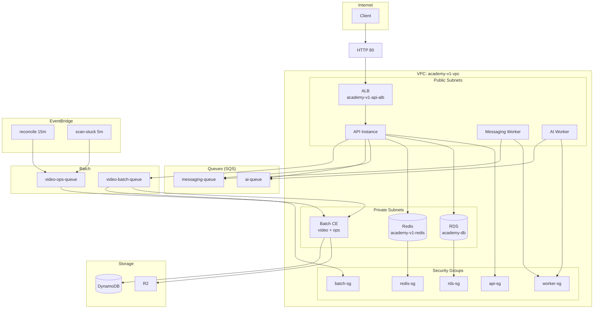

# Architecture Diagram — Mermaid



---

## Simplified Flow

```
Client → ALB → API ASG (EC2)
         ↓
    API → RDS, Redis, SQS, Batch
         ↓
    Workers (ASG) ← SQS (messaging, ai)
         ↓
    Batch (CE) ← EventBridge (reconcile, scan-stuck)
         ↓
    R2 (Cloudflare)
```
